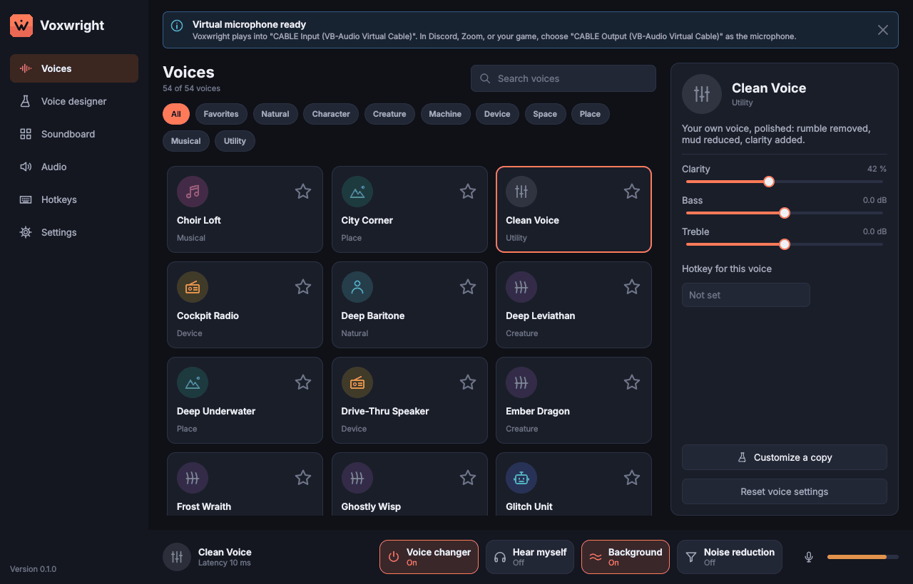

# Voxwright

Voxwright is a real-time voice changer and soundboard for Windows 11 and
macOS. It runs your microphone through layered voice effects, mixes in
soundboard clips and background ambience, and plays the result into a
virtual microphone that Discord, Zoom, Teams, OBS, and games can use.

## Download

**[Download the latest Windows installer](https://github.com/Yousefz-z/voxwright/releases/latest)**
(Windows 10 version 1809 or later, or Windows 11, 64-bit).

1. Install [VB-CABLE](https://vb-audio.com/Cable/) (free), the virtual
   microphone Voxwright plays into. Its setup needs administrator rights.
2. Run `Voxwright-...-windows-x64-setup.exe` from the release. It installs
   for your account without administrator rights. It is not code-signed
   yet, so SmartScreen warns: choose **More info**, then **Run anyway**.
3. Start Voxwright and follow the setup guide, then choose
   **CABLE Output (VB-Audio Virtual Cable)** as the microphone in Discord,
   Zoom, or your game.

There is no macOS download yet; see [Building from source](#building-from-source).

## Status

Development happens in milestones; each one is a commit.

| Milestone | Contents | State |
|---|---|---|
| 1 | C++20 DSP core, test-only offline render path, measurements | Done |
| 2 | Effect registry (21 blocks) and 54 voice presets, each measured | Done |
| 3 | Real-time engine, device routing, monitor, gate, noise reduction, push-to-talk | Done |
| 4 | Qt Quick app shell with device selection and live voice switching | Done |
| 5 | Soundboard with 18 built-in sounds, import, play modes, and global hotkeys | Done |
| 6 | Voice designer: effect chain editor with live preview, quick sliders, import and export | Done |
| 7 | Tray, settings, start at sign-in, setup guide with a virtual microphone check, text to speech, installers built by CI | Done |
| 8 | Optional neural voice conversion behind `VOX_ENABLE_ML`: ONNX Runtime, streaming block, benchmark (no model included) | Done |



Features marked Done pass their automated tests on a simulated audio
device and keyboard. What only real hardware can show (drivers, games,
latency) is listed in the [manual test checklist](docs/manual-test-checklist.md);
rows that have been run carry a date and a result, and the rest are not
verified yet.

## Documentation

* [Feature matrix](docs/feature-matrix.md): every feature, its priority, and how it is built.
* [Architecture](docs/architecture.md): layers, threads, signal flow, and the measurements behind each choice.
* [Voices](docs/voices.md): the voice catalogue, how each voice was measured and tuned, and spectrograms.
* [Neural voices](docs/ml.md): the experimental ONNX track, its model format, and CPU measurements.
* [Decisions](docs/decisions.md): scope decisions that must not be undone silently.
* [Manual test checklist](docs/manual-test-checklist.md): everything that needs real hardware and has not been verified yet.
* [Contributing](CONTRIBUTING.md): toolchain setup and the exact checks CI runs.

## Installers

CI builds the Windows installer (Inno Setup) for every pull request and
push to `main`, and a macOS disk image when the workflow is started by
hand. A version tag publishes the Windows installer as a
[release](https://github.com/Yousefz-z/voxwright/releases); see
[Releasing](CONTRIBUTING.md#releasing). The Windows installer has been
installed and used on Windows 11 (see the manual test checklist); the macOS
disk image has not been tried on a Mac yet. Neither installer is
code-signed, so Windows SmartScreen and macOS Gatekeeper warn on first
start (on macOS, right-click the app and choose Open). Voxwright needs a
virtual audio cable: [VB-CABLE](https://vb-audio.com/Cable/) on Windows or
[BlackHole 2ch](https://existential.audio/blackhole/) on macOS, both free.
The setup guide on first start links to them and checks that the cable
works.

## Building from source

Requirements and one-time setup (vcpkg at the pinned commit, Qt 6.8.3) are in
[CONTRIBUTING.md](CONTRIBUTING.md). Then:

```sh
cmake --preset release
cmake --build --preset release
ctest --preset release
```

Use the `windows` preset on Windows and the `macos` preset on macOS.

## License

See [docs/decisions.md](docs/decisions.md#d14-project-license) and
[THIRD_PARTY_NOTICES.md](THIRD_PARTY_NOTICES.md).
