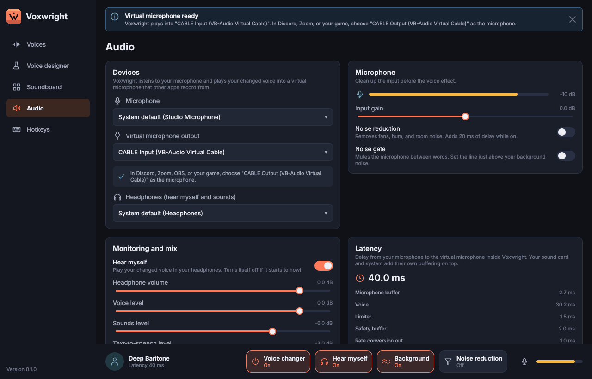
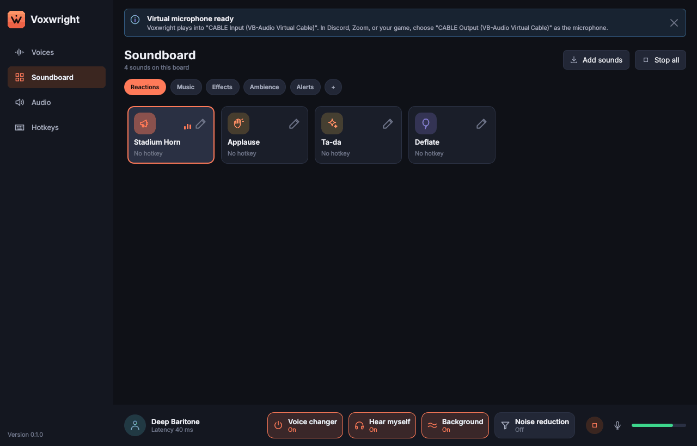
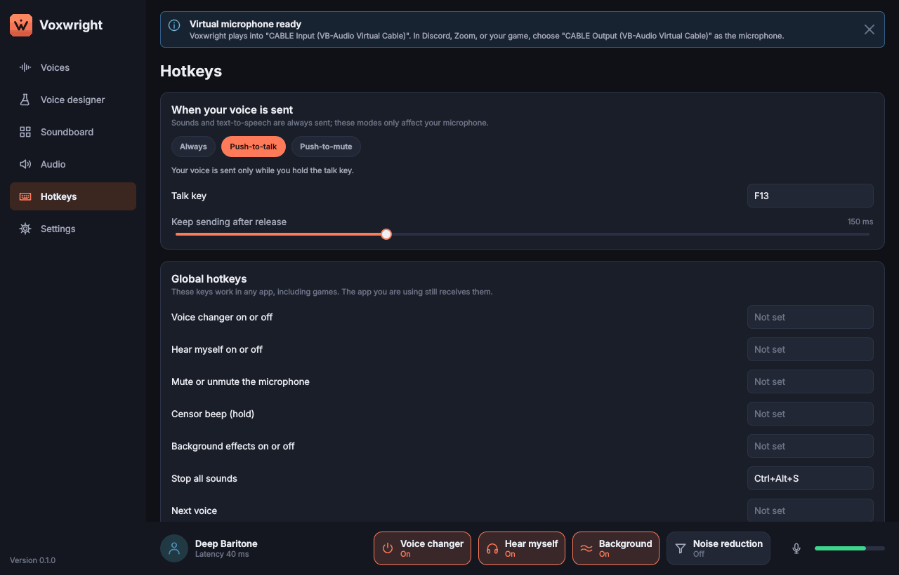
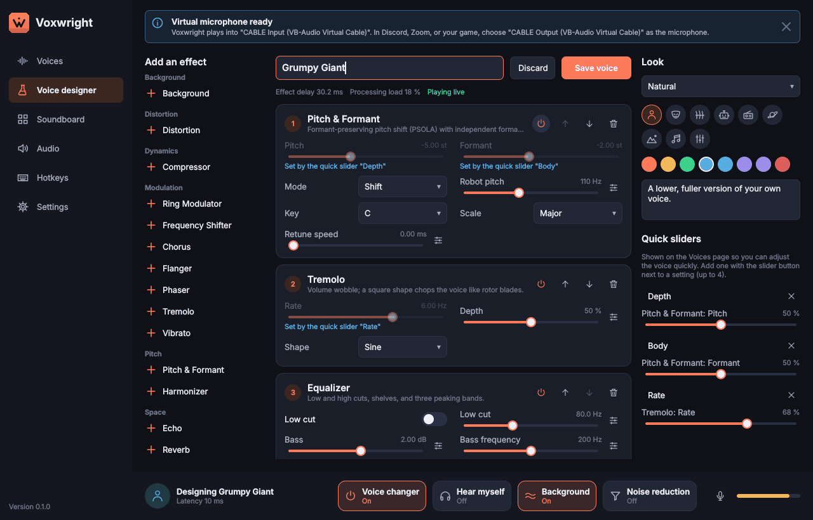
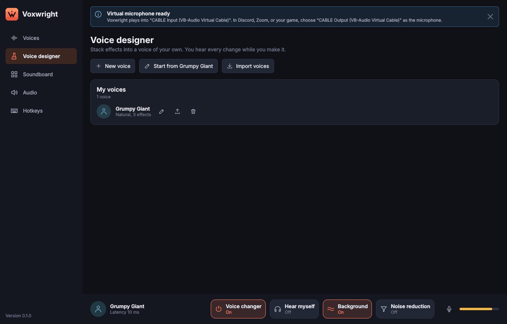
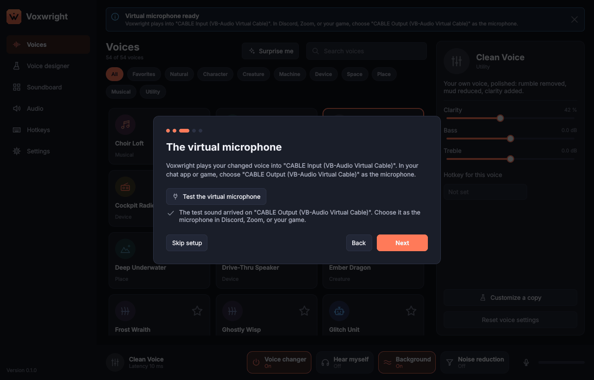
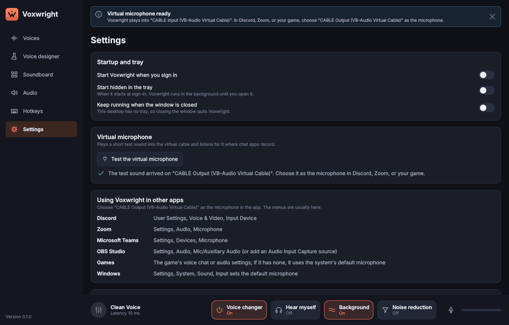

# Architecture

Voxwright is a real-time voice changer and soundboard for Windows 11 and
macOS. This document explains how it is built and why, with the
measurements behind each major choice. Numbers in this document come from
runs in the development container (4 vCPU x86-64, GCC 13.3, `-O2`, no
audio hardware) unless stated otherwise; the commands that produce them
are listed in [Reproducing the numbers](#reproducing-the-numbers).

## Layers

```
            +--------------------------------------------------------+
  app/      |  Qt Quick UI, view models, tray, hotkeys, autostart,   |
            |  settings, first-run flow, text-to-speech capture      |
            +-------------------+------------------+-----------------+
                                | commands (lock-free queues)        |
            +-------------------v------------------+                 |
  engine/   |  AudioEngine: graph, transmit control,|<---------------+
            |  soundboard player, mixer, limiter,   |  device events
            |  drift compensation, meters           |
            +----------+---------------+------------+
                       |               |
            +----------v-------+  +----v------------------------+
  plugins/  | effect registry, |  | devices/: AudioBackend       |
            | voice presets    |  | (miniaudio: WASAPI,         |
            | (JSON), macros   |  |  CoreAudio, ALSA/Pulse),    |
            +----------+-------+  |  FakeBackend for tests,     |
                       |          |  decoder, cable detection    |
            +----------v-------+  +-----------------------------+
  dsp/      | effects, filters,|
            | pitch, analysis  |
            +----------+-------+
  core/     | Result/Error, lock-free queues, ring buffers
            +------------------
```

Dependencies only point downward. `dsp/` and `core/` know nothing about
devices, threads, files, or Qt; `engine/` knows nothing about Qt;
`app/` is the only Qt module. Every layer below `app/` is tested directly
through Catch2 without a UI or audio device.

| Module | Contents | Third-party code |
|---|---|---|
| `core/` | `Result<T>`, typed `Error` with actionable messages, SPSC queue, SPSC ring buffer, object channel (hands heap objects to the audio thread and back) | none |
| `dsp/` | Biquad/SVF filters, delay lines, LFOs, envelope followers, pitch tracker, PSOLA pitch shifter, spectral shifter, vocoder, FDN reverb, dynamics, distortion, modulation effects, ambience synthesis, loudness meter, feedback detector, RNNoise wrapper, streaming and one-shot resamplers | Signalsmith Stretch (MIT), RNNoise (BSD-3), libsamplerate (BSD-2) |
| `plugins/` | Effect descriptors (parameter metadata), factory registry, node wrappers, preset and macro model, JSON preset parser, 54 voice presets | nlohmann/json (MIT) |
| `engine/` | Processing graph, voice chain hot swap, transmit control (mute, push-to-talk, push-to-mute, censor), soundboard player, speech player, mixer buses, output limiters, per-output drift compensation, device loss and recovery, latency breakdown, metering, command and event queues | none |
| `devices/` | `AudioBackend` interface, miniaudio backend with per-failure error mapping, fake backend (simulated time, injected failures and disconnects), audio file decoding, virtual cable detection | miniaudio (MIT-0) |
| `app/` | QML UI, view models, global hotkeys, tray, autostart, settings store, text to speech, setup guide with the virtual microphone check | Qt 6.8 (LGPL-3) |
| `ml/` | Optional (`VOX_ENABLE_ML`): ONNX voice model loader and the streaming "Neural Voice" effect ([ml.md](ml.md)) | ONNX Runtime (MIT), prebuilt |
| `drivers/` | macOS AudioServerPlugIn loopback driver source; Windows driver design | none |
| `tools/` | Internal development tools only: benchmarks, sound synthesis for the bundled sound pack, analysis scripts, ML export and benchmark. Not shipped. | none |

## Signal flow

All processing runs at 48 kHz, 32-bit float, mono for the voice path.
Output devices receive the mono mix on every channel.

```
mic (any rate, any channels)
  --> average to mono --> rate convert to 48 kHz (only if needed)
  --> input gain --> DC blocker
  --> noise suppression (RNNoise; crossfaded, no latency while off)
  --> noise gate (optional)
  --> feedback detector (watches for howl while hear-myself is on)
  --> transmit control (mute, push-to-talk, push-to-mute, censor beep)
  --> microphone paused (20 ms fade) while speech plays "through my voice",
      and that speech added (D43)
  --> voice chain (preset blocks, tone, background ambience;
                   20 ms crossfade on switch, crossfade to dry when off)
  --> voice level x voice duck (a sound with "mute my voice" playing)
        |
        +--------------------+------------------------------+
                             |                              |
soundboard player ---- all sounds ---+       sounds except "mute for me"
speech player ------ speech (direct) +                      |
                             v                              v
                    virtual mic mix            monitor mix: voice x hear-myself
                    --> limiter (-1 dBFS)        (or speech through the voice)
                                               + sounds + speech, x monitor level
                    --> output stage           --> limiter (-1 dBFS)
                        (resample, drift trim) --> output stage
                    --> virtual cable          --> headphones
```

Speech and sounds are mixed after transmit control, so push-to-talk and
mute silence the microphone but not the soundboard.

## Threads

| Thread | Work | Rules |
|---|---|---|
| Capture callback (device) | **Push mode**, whenever a microphone is open: downmix and convert the input, run the processing graph, write each output's ring buffer through its output stage. | No locks, no allocation, no system calls beyond reading the clock. Checked by an allocation trap around the capture callback path and around the graph with every feature active. |
| Playback callbacks (one per output) | Read the ring buffer. **Pull mode**, when no microphone is open (none selected, or it was unplugged): the virtual mic's callback (or the headphones', if there is no virtual mic) runs the graph itself before reading, so sounds and speech keep playing. | Same rules. |
| Control thread (Qt main thread) | UI, building voice chains, decoding sounds, settings, `AudioEngine::poll()` at 30 Hz for events, garbage, and device changes | Never touches audio state directly; sends commands. |
| Device notification thread (OS) | Device added, removed, stopped, or rerouted | Only queues the event under a mutex; the control thread acts on it in `poll()`. |
| Hotkey thread (Windows) | Low-level keyboard hook message loop | Posts events to the control thread and writes push-to-talk and censor state straight into atomics so they do not wait for the UI. Keys are always passed on. On macOS, Carbon delivers hotkeys on the main run loop, which writes the same atomics. |
| Worker pool (Qt Concurrent) | Decoding imported sounds and rendering the built-in ones | Results return to the control thread, which hands each clip to the engine through the object channel. |

Only one thread runs the graph at a time: the mode is fixed while streams
run, and every stream is stopped before the engine switches modes or
reopens devices.

Communication between control and audio threads uses three primitives
from `core/`:

* **Command queue** (SPSC, 1024 entries): parameter changes, toggles,
  sound triggers. Drained at the start of every audio block, after new
  objects are adopted, so a sound loaded and then triggered plays. While
  no stream runs, the control thread applies commands itself, so settings
  made while stopped are kept and the queue never fills.
* **Object channel** for large objects (a newly built voice chain, a
  decoded clip, synthesized speech): ownership passes by pointer through
  one queue; the audio thread returns retired objects (a replaced chain,
  the clip a new one replaced) through a second queue, so they are
  destroyed on the control thread, never on the audio thread.
* **Event queue** (SPSC, audio to control): sound finished, speech
  finished, feedback detected. Meters are relaxed atomics.

### Output stages and clock drift

Each output device runs on its own crystal, which differs from the
microphone's by tens to a few hundred parts per million. Each output
therefore has an output stage: a libsamplerate converter (90 % bandwidth
setting) into a ring buffer, whose ratio a PI controller trims by up to
+-0.5 %.

* The controller measures the fill the buffer would have if the device
  read continuously (ring fill minus the frames the device has played
  since its last read, from the backend's clock) once per producer
  callback, just before it writes. That quantity does not jump when a
  device read moves past a producer write, so the controller does not
  chase the beat between the two callback rates.
* Target: 2 ms at that point, which covers scheduling jitter. Because the
  measurement already accounts for the next device read, no further
  period of buffering is needed.
* For 20 s after a start or a refill the loop runs fast (0.4 rad/s) to
  find the clock difference; then it tracks slowly (0.1 rad/s) with the
  error and the trim both smoothed, so jitter does not reach the ratio as
  phase noise. Per-block random ratio noise of +-37 ppm measured 72 dB
  tone-to-noise; the tracking loop holds the ratio within about 10 to
  20 ppm and the output at 97 dB, the converter's own floor at a
  non-unity ratio.
* At start and after an underrun the stage plays silence until it holds
  the target plus one device period plus the producer's last burst, then
  resumes; the first reads cannot run dry.
* In pull mode the driving output renders inside its own callback, so it
  has no drift and no refill margin ("synchronous").

## Pitch and formant shifting

Pitch shifting quality decides how good most voices sound, so two engines
were built and measured against each other on the same material.

1. **PSOLA shifter** (`dsp::PsolaShifter`, written for this project). A
   pitch tracker (YIN cumulative-mean-normalized difference on a 4x
   decimated signal every 2.7 ms, refined on the full-rate signal with
   parabolic interpolation, median of three against octave errors) finds
   the period. Pitch marks are placed one period apart and aligned by
   normalized cross-correlation with the previous mark, so every grain
   starts at the same phase of the cycle. Two-period Hann grains are
   overlap-added at the target period. Formants move independently by
   resampling each grain before it is added. Unvoiced frames use a fixed
   5 ms grain spacing so noise passes through unchanged. Grains are
   rendered lazily, just ahead of emission, so each one uses the pitch mark
   nearest its own time and the measured delay equals the reported latency
   (test `PSOLA latency matches the reported value`).
   Latency is 2.25 times the longest expected period plus 8 samples:
   1448 samples (30.2 ms) for a 75 Hz minimum pitch.
2. **Spectral shifter** (`dsp::SpectralShifter`, wraps Signalsmith
   Stretch 1.4). Phase-vocoder transposition with optional cepstral formant
   compensation.

Result ([Pitch engine comparison](#pitch-engine-comparison)): PSOLA is
more accurate, much cleaner, and has lower latency for live speech. The
spectral engine needs analysis blocks several pitch periods long (its
library default is 120 ms); at 20 to 43 ms it makes octave errors on low
voices, and its formant compensation does not hold close vowel formants in
place even when given the true fundamental (an F2 of 1077 Hz moved to
2473 Hz for a 180 Hz voice shifted down 5 semitones). Every live voice
therefore uses PSOLA. The spectral engine is kept for offline
transposition of soundboard clips, where latency is irrelevant and clips
are often polyphonic.

Rejected alternatives:

* **Rubber Band**: excellent quality, but GPL or a paid license, and its
  R3 engine has more latency than the targets here.
* **Plain delay-line (two-tap) shifter**: lowest latency, but it moves
  formants with pitch and adds flanging. PSOLA with the formant ratio set
  equal to the pitch ratio produces the same "chipmunk" sound when a voice
  wants it, so no separate engine is needed.

## Noise suppression

RNNoise v0.1.1: 48 kHz native, 10 ms frames (20 ms of latency: one frame to
collect, one inside RNNoise's overlap-add; measured, see below), a
recurrent model small enough for any CPU. Suppression of stationary noise
after one second of adaptation (`vox_bench_noise`, see
[Reproducing the numbers](#reproducing-the-numbers)):

| Noise | Input level (dBFS) | Reduction after 1 s (dB) |
|---|---|---|
| White | -58.7 | -30.5 |
| White | -38.7 | -1.6 |
| White | -24.8 | -6.0 |
| Pink | -53.5 | -34.3 |
| Pink | -33.5 | -38.4 |
| Pink | -19.5 | -16.6 |
| Brown | -57.5 | -43.7 |
| Brown | -37.5 | -39.4 |
| Brown | -23.5 | -48.4 |

The model removes 17 to 48 dB of room-like (pink and brown) noise at every
level tested and 30 dB of quiet white noise, but leaves loud full-band white
noise mostly in place (2 to 6 dB). Real microphone noise is pink or brown (fans, traffic, hum), and the
noise gate covers the remaining hiss between words. The unit test
`Noise suppressor removes stationary noise and keeps speech` checks a
phrase in pink noise at about 10 dB SNR: 16.7 dB less noise in pauses, and
the vowel level changes by less than 0.1 dB.

DeepFilterNet gives better suppression of non-stationary noise but needs a
20 ms frame plus look-ahead and several times the CPU; it is listed for
evaluation in the ML track. RNNoise v0.2 has a better model but downloads
its weights from a separate host at build time; see
[decisions.md](decisions.md#d5-rnnoise-version).

## Audio I/O

miniaudio 0.11.25 over PortAudio:

* One C file, no build system to integrate, MIT-0 license.
* WASAPI shared and exclusive mode, CoreAudio, ALSA/PulseAudio, and a
  null backend, with device enumeration and change notifications.
* Bundles WAV, MP3, and FLAC decoders (plus stb_vorbis for OGG), which
  the soundboard needs anyway.
* PortAudio would add a second build, and its WASAPI exclusive support
  and device notifications are weaker.

The devices layer opens every device at its native rate and channel
count. miniaudio reports events per open stream only, so the backend
also re-reads the device lists every 2 s and reports additions and
removals ([decisions.md](decisions.md#d23-device-lists-are-polled-every-2-seconds)). Rate conversion and drift compensation happen in the engine with
libsamplerate so quality does not depend on the backend's built-in
linear resampler.

### Latency budget

Microphone to virtual microphone, engine side: one capture period +
input conversion (only if the microphone is not at 48 kHz, about 1 ms) +
noise suppression (20 ms, only while on) + the voice's algorithmic
latency (0 for filter and effect voices, 30.2 ms for pitch-shifted voices
at the default 75 Hz lowest pitch) + limiter look-ahead (1.5 ms) + ring
buffer target (2 ms) + output conversion (about 1 ms) + one playback
period. `AudioEngine::stats()` reports each term from the devices'
actual periods and rates; that is the latency readout in the UI.

On top of that come buffers the engine cannot see: the Windows audio
engine's period in shared mode (typically 10 ms; exclusive mode removes
it) and driver and converter buffering. Measured engine-side numbers are
in [Engine measurements](#engine-measurements); the full round trip must
be measured on real hardware
([manual-test-checklist.md](manual-test-checklist.md), item A6).

## Virtual microphone

The engine treats the virtual microphone as a normal output device. Any
loopback driver (VB-CABLE, BlackHole, or a first-party driver) exposes a
render endpoint the engine plays into and a capture endpoint that chat
apps record from. This keeps the engine free of driver-specific code:
the first-run flow detects the cable by name and verifies it with a
loopback chirp test.

The first-party driver path is designed but not shippable from this
environment:

* `drivers/macos/`: AudioServerPlugIn loopback device in C (one output
  stream, one input stream, a ring buffer indexed by sample time inside the
  plug-in). Written without access to a Mac; CI compiles it in a job that
  does not gate the build, and nothing has loaded or tested it. Installing
  requires a Developer ID signature and notarization.
* `drivers/windows/README.md`: design for a WaveRT virtual audio device
  pair (render and capture) based on the Windows driver samples,
  requiring the WDK, an EV certificate, and Microsoft attestation
  signing.

## User interface

Qt 6.8 LTS with Qt Quick (QML), chosen over JUCE:

| | Qt 6 Quick | JUCE 8 |
|---|---|---|
| UI model | Declarative QML, GPU scene graph, built-in animations, states, transitions | Imperative `Component` painting on CPU (or OpenGL context) |
| Native integration | System tray, file dialogs, text-to-speech, high-DPI, accessibility, autostart via platform APIs | Tray and dialogs available; no text-to-speech |
| License | LGPL-3 for every module used (dynamic linking satisfies it) | AGPL-3 or a paid license for closed distribution |
| Audio | Not used (miniaudio handles audio) | Its main strength, not needed here |

Global hotkeys are not part of Qt, so `app/src/hotkeys/` implements them
per OS behind one `GlobalHotkeys` interface: a low-level keyboard hook on
Windows, Carbon `RegisterEventHotKey` on macOS, and a stub on Linux that
reports them unavailable (see
[feature-matrix.md](feature-matrix.md#12-global-hotkeys) and
[D25](decisions.md#d25-global-hotkeys-never-swallow-keys)). The tests use a
`ManualHotkeys` implementation that presses keys on demand, so everything
above the OS call is tested; the Windows and macOS files are compiled only
by CI on those platforms and are on the
[manual test checklist](manual-test-checklist.md#soundboard-and-hotkeys-milestone-5).

### App structure

* `vox_app_core` (static library) holds everything except `main()`:
  `AppContext` owns the audio backend, the engine, the settings, and the
  controllers. `AudioController` covers devices (with fallbacks when a
  saved device is missing and automatic selection of a newly found
  virtual cable), input processing, mix levels, meters and the latency
  readout at 30 Hz, and turns engine events into notifications with a
  specific message and action. `VoiceController` owns the voice grid
  model and its filter, the active voice, macro and tone sliders, and
  favorites. `HotkeyController` checks and dispatches global hotkeys for
  actions, voices, and sounds, refusing a key already in use with a
  message naming its owner. `SoundboardController` owns the boards, the
  sound grid model, importing (copy into the library folder, decode on a
  worker thread, a specific message per failed file), per-sound options,
  and the playing state; `SoundboardStore` saves the boards as
  `soundboards.json`. `DesignerController` edits a draft voice with the
  operations in `plugins/voice_edit.hpp` (insert, remove, and move blocks
  with their macro targets, expose a setting as a quick slider), plays it
  as the active voice while it changes, and saves it through
  `CustomVoiceStore` (one JSON file per voice). `SettingsStore` saves
  `AppSettings` as JSON. The QML module
  `Voxwright` (pages, components, theme, icons) is compiled into the same
  library, so tests run exactly what the app runs.
* `voxwright` is the executable: `main()` creates the system backend (or,
  if no audio system starts, opens the window anyway with the reason in a
  banner) and loads `Main.qml`.
* `vox_app_tests` covers the settings and soundboard stores, the models,
  and the controllers on the fake backend (a sound pressed by its
  hotkey is measured on the virtual-mic bus), plus UI smoke tests
  that load the real QML offscreen with the software renderer, click
  through every page, resize the window down to its minimum with a sound
  playing, fail on any QML warning, and save screenshots.

Icons are line drawings made for Voxwright, stored as SVG path data in
`Icons.qml` and drawn with Qt Quick Shapes so they take theme colors.
Each icon renders into a layer: the software renderer (used without a
GPU, in virtual machines and remote desktop sessions, and in the tests)
does not clip Shape nodes to a scrolling view, which the screenshot test
showed as icons drawn outside the voice grid.

| Voices | Audio |
|---|---|
|  |  |
| **Soundboard** | **Hotkeys** |
|  |  |
| **Voice designer** | **Voice designer, saved voices** |
|  |  |

Rendered by the UI test on the fake backend (a synthetic 220 Hz tone on
the microphone), so the meters and latency are real engine output.

### Desktop integration

* `TrayController`: the tray icon and its menu ([D30](decisions.md#d30-the-tray-uses-qt-widgets)).
* `SystemController` with `Autostart`: start at sign-in (Run key, LaunchAgent,
  or XDG file), start hidden (`--minimized`), keep running when closed, and
  the first-run flag.
* `SpeechController`: text to speech through `QTextToSpeech::synthesize()`,
  converted to 48 kHz mono for the engine's speech channel.
* `VirtualMicCheck`: the loopback check ([D33](decisions.md#d33-the-virtual-microphone-check-listens-where-chat-apps-listen)).
* Packaging: `cmake --install` produces a self-contained tree (Qt deployed
  by `qt_generate_deploy_qml_app_script`, licenses in `licenses/`), which
  `installer/windows/voxwright.iss` and `installer/macos/make-dmg.sh` turn
  into an installer and a disk image in CI ([D32](decisions.md#d32-installers-are-built-by-ci-and-are-not-signed-yet)).
  The program icon is rendered from `app/icons/app.svg` by `tools/icons`.

| Setup guide | Settings |
|---|---|
|  |  |

## Effects as data

Every effect block registers an `EffectDescriptor` with parameter
metadata (id, name, unit, range, skew, default). Voices are JSON files
that name blocks and parameter values and declare macro sliders mapped to
block parameters. The designer UI renders any block from its descriptor,
so adding an effect means writing the DSP class and one registration;
adding a voice means writing JSON.

## Dependencies

All C and C++ dependencies come from vcpkg in manifest mode. Each one is
an overlay port in `ports/` that fetches its source by full commit hash
over git, so builds are reproducible without trusting tags or archive
hosting. `vcpkg.json` pins the vcpkg registry baseline used for the
helper ports. Qt is installed separately at an exact version (6.8.3) by
CI and by the development container; see
[decisions.md](decisions.md#dependency-pinning).

| Package | Version | Commit | License |
|---|---|---|---|
| miniaudio | 0.11.25 | 9634bedb | MIT-0 or Unlicense |
| libsamplerate | 0.2.2 | c96f5e3d | BSD-2-Clause |
| Signalsmith Stretch | 1.4.0 | a670068d | MIT |
| Signalsmith Linear | 0.6.4 | de55e6a5 | MIT |
| RNNoise | 0.1.1 | 6cbfd53e | BSD-3-Clause |
| nlohmann/json | 3.12.0 | 55f93686 | MIT |
| Catch2 (tests only) | 3.9.1 | 644821ce | BSL-1.0 |
| Qt | 6.8.3 | v6.8.3 tag | LGPL-3 |

## Measurements

The sections below are filled from actual runs. Each table names the test
or tool that produced it.

### Pitch engine comparison

Produced by `vox_bench_pitch` (RelWithDebInfo, GCC 13, `-O2`). Input:
synthetic vowels with known pitch and formants (Rosenberg glottal pulses
through five formant resonators, 0.2 % jitter). "Envelope error vs ideal"
compares the LPC spectral envelope (order 44, 200 Hz to 5 kHz) of the output
with the same vowel synthesized directly at the target pitch; the
reference row shows the measurement floor (0 dB) and the "formants move"
rows show what an uncorrected shift costs (11 to 17 dB). CPU is the
fraction of one core of this container's 4 vCPU x86-64 machine.

Synthetic vowels /a/ /i/ /u/ at f0 100, 180, 260 Hz; 9 cases per row.

| Engine | Shift (st) | Mean pitch error (cents) | Max pitch error (cents) | Voiced frames | YIN aperiodicity | Envelope error vs ideal (dB) | Latency (ms) | CPU (x real time) |
|---|---|---|---|---|---|---|---|---|
| Reference: ideal shift | -12 | 0.5 | 0.7 | 100 % | 0.002 | 0.0 | 0.0 | 0.0000 |
| Reference: ideal shift | -5 | 0.1 | 0.2 | 100 % | 0.001 | 0.0 | 0.0 | 0.0000 |
| Reference: ideal shift | +5 | 0.1 | 0.2 | 100 % | 0.001 | 0.0 | 0.0 | 0.0000 |
| Reference: ideal shift | +12 | 0.2 | 0.4 | 100 % | 0.001 | 0.0 | 0.0 | 0.0000 |
| PSOLA (min f0 75 Hz) | -12 | 0.5 | 0.9 | 100 % | 0.001 | 5.2 | 30.2 | 0.0307 |
| PSOLA (min f0 75 Hz) | -5 | 0.5 | 0.9 | 100 % | 0.001 | 5.2 | 30.2 | 0.0327 |
| PSOLA (min f0 75 Hz) | +5 | 0.4 | 0.7 | 100 % | 0.001 | 5.7 | 30.2 | 0.0331 |
| PSOLA (min f0 75 Hz) | +12 | 0.5 | 1.0 | 100 % | 0.002 | 6.2 | 30.2 | 0.0337 |
| Spectral 20 ms, formants kept | -12 | 412.2 | 1200.0 | 87 % | 0.117 | 8.6 | 20.0 | 0.0145 |
| Spectral 20 ms, formants kept | -5 | 582.5 | 1443.3 | 89 % | 0.110 | 5.7 | 20.0 | 0.0165 |
| Spectral 20 ms, formants kept | +5 | 590.4 | 1716.9 | 93 % | 0.084 | 7.2 | 20.0 | 0.0165 |
| Spectral 20 ms, formants kept | +12 | 566.6 | 1297.4 | 80 % | 0.095 | 10.5 | 20.0 | 0.0168 |
| Spectral 20 ms, formants move | -12 | 311.1 | 1325.9 | 93 % | 0.058 | 16.0 | 20.0 | 0.0128 |
| Spectral 20 ms, formants move | -5 | 713.1 | 1889.3 | 93 % | 0.102 | 10.7 | 20.0 | 0.0118 |
| Spectral 20 ms, formants move | +5 | 648.5 | 1761.2 | 100 % | 0.049 | 11.9 | 20.0 | 0.0123 |
| Spectral 20 ms, formants move | +12 | 543.7 | 1289.6 | 98 % | 0.060 | 16.3 | 20.0 | 0.0123 |
| Spectral 30 ms, formants kept | -12 | 155.9 | 1209.1 | 88 % | 0.117 | 7.7 | 30.0 | 0.0154 |
| Spectral 30 ms, formants kept | -5 | 721.0 | 1905.1 | 81 % | 0.102 | 5.5 | 30.0 | 0.0166 |
| Spectral 30 ms, formants kept | +5 | 590.1 | 1861.3 | 89 % | 0.091 | 6.4 | 30.0 | 0.0163 |
| Spectral 30 ms, formants kept | +12 | 483.2 | 1808.4 | 88 % | 0.088 | 8.2 | 30.0 | 0.0173 |
| Spectral 30 ms, formants move | -12 | 165.8 | 1192.4 | 100 % | 0.032 | 16.2 | 30.0 | 0.0124 |
| Spectral 30 ms, formants move | -5 | 439.5 | 1200.0 | 79 % | 0.098 | 10.8 | 30.0 | 0.0135 |
| Spectral 30 ms, formants move | +5 | 315.8 | 1617.1 | 100 % | 0.037 | 11.6 | 30.0 | 0.0137 |
| Spectral 30 ms, formants move | +12 | 533.4 | 1202.2 | 100 % | 0.036 | 15.5 | 30.0 | 0.0139 |
| Spectral 43 ms, formants kept | -12 | 136.0 | 1183.9 | 99 % | 0.040 | 7.9 | 42.7 | 0.0180 |
| Spectral 43 ms, formants kept | -5 | 337.8 | 1200.0 | 72 % | 0.134 | 5.4 | 42.7 | 0.0185 |
| Spectral 43 ms, formants kept | +5 | 556.7 | 1890.2 | 81 % | 0.128 | 5.9 | 42.7 | 0.0197 |
| Spectral 43 ms, formants kept | +12 | 268.0 | 1202.0 | 100 % | 0.025 | 7.1 | 42.7 | 0.0194 |
| Spectral 43 ms, formants move | -12 | 10.8 | 22.9 | 100 % | 0.004 | 16.5 | 42.7 | 0.0148 |
| Spectral 43 ms, formants move | -5 | 169.8 | 787.2 | 81 % | 0.076 | 10.7 | 42.7 | 0.0154 |
| Spectral 43 ms, formants move | +5 | 4.5 | 9.6 | 100 % | 0.040 | 11.4 | 42.7 | 0.0181 |
| Spectral 43 ms, formants move | +12 | 3.9 | 5.9 | 100 % | 0.017 | 15.2 | 42.7 | 0.0158 |
| Spectral 120 ms, formants kept | -12 | 267.7 | 1203.4 | 100 % | 0.018 | 7.0 | 120.0 | 0.0166 |
| Spectral 120 ms, formants kept | -5 | 113.8 | 505.0 | 100 % | 0.006 | 4.6 | 120.0 | 0.0177 |
| Spectral 120 ms, formants kept | +5 | 268.3 | 1907.4 | 100 % | 0.027 | 4.5 | 120.0 | 0.0177 |
| Spectral 120 ms, formants kept | +12 | 3.5 | 9.5 | 100 % | 0.016 | 5.3 | 120.0 | 0.0173 |
| Spectral 120 ms, formants move | -12 | 1.8 | 4.7 | 100 % | 0.003 | 17.1 | 120.0 | 0.0129 |
| Spectral 120 ms, formants move | -5 | 3.9 | 9.6 | 100 % | 0.001 | 10.7 | 120.0 | 0.0139 |
| Spectral 120 ms, formants move | +5 | 2.1 | 3.9 | 100 % | 0.001 | 11.3 | 120.0 | 0.0147 |
| Spectral 120 ms, formants move | +12 | 1.0 | 2.9 | 100 % | 0.001 | 15.1 | 120.0 | 0.0140 |

How to read it:

* PSOLA: mean error 0.4 to 0.5 cents (max 1.0), output as periodic as the
  input (aperiodicity 0.001 to 0.002), envelope error 5 to 6 dB, 30.2 ms
  latency, 3 % of one core.
* Spectral at 20 to 43 ms: octave errors (mean errors of hundreds of
  cents) and noisier output on these voices.
* Spectral at 120 ms, formants moving: accurate (1 to 4 cents mean) and
  clean, which confirms the integration is correct; that mode is used for
  offline clip transposition.
* Spectral at 120 ms with formant compensation: still makes octave errors
  in some cases.

### Engine measurements

Produced by `vox_bench_engine` (RelWithDebInfo, GCC 13, `-O2`) and
checked by the engine test suite.

**Processing cost** of the whole graph (input conditioning, voice,
soundboard, mixing, both limiters) per 128-frame block, on the synthetic
phrase:

| Configuration | Mean (% of block) | 99th percentile (% of block) | Worst (% of block) |
|---|---|---|---|
| No voice | 2.3 | 11.5 | 106.8 |
| No voice, noise reduction on | 2.1 | 9.9 | 12.3 |
| Clean Voice | 2.4 | 10.5 | 14.0 |
| Deep Baritone (PSOLA) | 4.2 | 13.4 | 63.7 |
| Choir Bot (vocoder + harmonizer) | 3.6 | 12.0 | 26.1 |
| Cathedral (reverb) | 3.0 | 10.6 | 162.5 |
| Designer maximum (12 heavy effects) | 15.0 | 34.4 | 305.5 |

RNNoise runs on every block (so it is ready when switched on) but
processes a whole 10 ms frame in one of every 3.75 blocks, which sets the
99th percentile. The worst single blocks include preemption by other work
on the shared 4-vCPU virtual machine (the graph without a voice shows
spikes past a whole block); the 99th percentile is the meaningful figure.
"Designer maximum" is the largest voice the designer allows: pitch,
harmonizer, vocoder, reverb, whisper, chorus, flanger, phaser, echo,
distortion, filter, and resonator in one chain
([D29](decisions.md#d29-a-voice-holds-up-to-12-effects-and-4-quick-sliders)).
Checklist items A14 and D4 measure the load on a slow real machine, where
the processing load readout (Audio page and designer) shows it.

**Latency**, microphone to virtual microphone, engine side. The fake
backend runs the devices in lock-step in simulated time, so the measured
delay excludes one capture and one playback period (which lock-step
pumping does not have) and includes half a period of offset between the
two callbacks; the estimate is what the engine reports in
`EngineStats::virtualMicLatency`.

| Period (frames) | Voice | Noise reduction | Capture | Noise red. | Voice | Limiter | Buffer | Resampler | Playback | Estimate (ms) | Measured, lock-step (ms) |
|---|---|---|---|---|---|---|---|---|---|---|---|
| 64 | none | off | 1.33 | 0.00 | 0.00 | 1.48 | 2.00 | 0.98 | 1.33 | 7.1 | 5.1 |
| 64 | Deep Baritone | on | 1.33 | 20.00 | 30.17 | 1.48 | 2.00 | 0.98 | 1.33 | 57.3 | 55.2 |
| 128 | none | off | 2.67 | 0.00 | 0.00 | 1.48 | 2.00 | 0.98 | 2.67 | 9.8 | 5.8 |
| 128 | Deep Baritone | on | 2.67 | 20.00 | 30.17 | 1.48 | 2.00 | 0.98 | 2.67 | 60.0 | 55.8 |
| 256 | none | off | 5.33 | 0.00 | 0.00 | 1.48 | 2.00 | 0.98 | 5.33 | 15.1 | 7.1 |
| 256 | Deep Baritone | on | 5.33 | 20.00 | 30.17 | 1.48 | 2.00 | 0.98 | 5.33 | 65.3 | 57.2 |
| 480 | none | off | 10.00 | 0.00 | 0.00 | 1.48 | 2.00 | 0.98 | 10.00 | 24.5 | 9.4 |
| 480 | Deep Baritone | on | 10.00 | 20.00 | 30.17 | 1.48 | 2.00 | 0.98 | 10.00 | 74.6 | 59.4 |

With Clean Voice-type voices (no pitch shift) and noise reduction off,
the engine side is 7 to 10 ms at 64 to 128-frame periods, inside the
20 ms round-trip target once the device adds its own buffering (to be
measured, checklist A6). Pitch-shifted voices add 30.2 ms of algorithmic
latency (two periods of the lowest expected voice pitch, 75 Hz), and
noise reduction adds 20 ms.

**Drift compensation**, from `OutputStage` between a producer on the
engine clock and a device whose clock runs fast or slow, with producer
callbacks up to 1.5 ms late at random (test `Output stage absorbs clock
drift without dropouts`):

| Device rate | Producer/device block | Clock error (ppm) | Underruns | Overruns | Trim found (ppm) | Trim spread (ppm) | Mean buffer (ms) | Tone-to-noise (dB) |
|---|---|---|---|---|---|---|---|---|
| 48000 | 128/128 | -300 | 0 | 0 | -298.4 | 9.6 | 3.34 | 97.4 |
| 48000 | 128/128 | +0 | 0 | 0 | +1.8 | 9.9 | 2.82 | 125.3 |
| 48000 | 128/128 | +300 | 0 | 0 | +301.6 | 9.7 | 3.36 | 97.4 |
| 44100 | 128/441 | -300 | 0 | 0 | -298.4 | 9.7 | 3.45 | 97.4 |
| 44100 | 128/441 | +0 | 0 | 0 | +1.7 | 9.6 | 3.39 | 125.4 |
| 44100 | 128/441 | +300 | 0 | 0 | +301.6 | 9.7 | 3.42 | 97.5 |
| 48000 | 480/128 | -300 | 0 | 0 | -299.6 | 21.8 | 7.04 | 97.5 |
| 48000 | 480/128 | +0 | 0 | 0 | +0.8 | 21.0 | 7.01 | 125.7 |
| 48000 | 480/128 | +300 | 0 | 0 | +300.4 | 21.8 | 7.04 | 97.4 |
| 96000 | 256/512 | -300 | 0 | 0 | -301.7 | 15.7 | 3.99 | 97.4 |
| 96000 | 256/512 | +0 | 0 | 0 | -1.6 | 15.9 | 2.77 | 122.6 |
| 96000 | 256/512 | +300 | 0 | 0 | +298.3 | 16.0 | 4.99 | 97.5 |

97.4 dB is the converter's own floor at a non-unity ratio (a fixed
1.0003 ratio measures the same); at exactly matched clocks the output is
125 dB clean.

Other engine results, each from a named test in `engine/tests/`:

* Voice switching: no sample step larger than the input sine's own
  slope during the 20 ms crossfade; the new voice is at its exact preset
  level from its first sample (a new chain settles its parameter ramps
  before it is handed over).
* Allocation: zero allocations or frees on the audio path with noise
  reduction, gate, hear-myself, six voice switches, a clip replacement,
  speech, and overlapping sounds in flight, and through the whole
  capture callback including input resampling.
* Device loss: losing the microphone keeps the soundboard playing into
  the virtual mic (pull mode) and reopens the microphone when it returns;
  losing the headphones keeps the virtual mic running; a returning
  device that fails to open is skipped, and only when nothing can be
  reopened does the engine stop with the backend's reason.
* Threads: capture, two playback threads at different rates, and the
  control thread switching voices, loading sounds, and queueing speech
  for 1.5 s run clean under ThreadSanitizer.

## Reproducing the numbers

All tools live in `tools/` and are built with the default presets (they
need the test support library, so `VOX_BUILD_TESTS` must be on).

```sh
cmake --preset release && cmake --build --preset release
./build/release/tools/vox_bench_pitch   # pitch engine comparison table
./build/release/tools/vox_bench_noise   # RNNoise suppression table
./build/release/tools/vox_bench_engine  # engine cost, latency, and drift tables
ctest --preset release                  # every functional test quoted above
```
