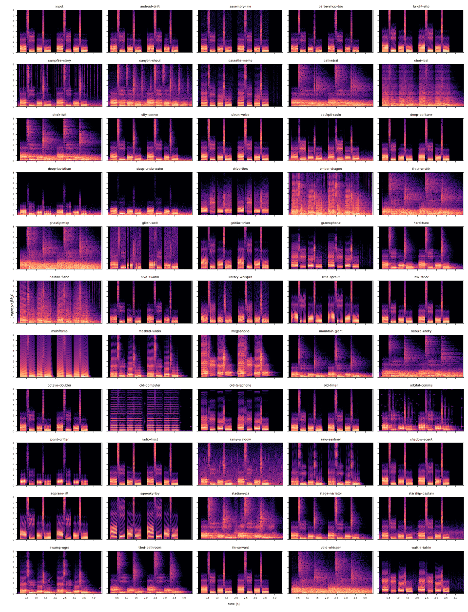

# Voices

Voxwright ships 54 original voices. Each is a JSON file in [`plugins/voices/`](../plugins/voices) that chains effect blocks from the registry and exposes one to three quick sliders (macros). Every voice also gets Bass and Treble sliders from the finishing tone stage.

## Catalogue

### Natural

| Voice | Description | Blocks | Sliders |
|---|---|---|---|
| Bright Alto | Higher pitch and a lighter vocal tract. | pitch + eq | Height, Lightness |
| Deep Baritone | A lower, fuller version of your own voice. | pitch + eq | Depth, Body |
| Little Sprout | A small child: high pitch and a short vocal tract. | pitch + eq | Age |
| Low Tenor | Slightly deeper and calmer; subtle enough for meetings. | pitch | Depth |
| Old Timer | Shaky, breathy, and a little hoarse. | pitch + vibrato + whisper + eq | Tremble, Breath |
| Soprano Lift | A high, airy voice with raised formants. | pitch + eq | Height, Lightness |

### Character

| Voice | Description | Blocks | Sliders |
|---|---|---|---|
| Library Whisper | Every word whispered, no matter how you speak. | whisper + eq | Breath |
| Masked Villain | A menacing, gravelly voice behind a mask. | pitch + distortion + comb + reverb | Menace, Grit |
| Mountain Giant | An enormous, slow, booming voice. | pitch + eq + reverb | Size, Space |
| Shadow Agent | An anonymous informant: disguised pitch and formants. | pitch + compressor + eq | Disguise |
| Squeaky Toy | A tiny, sped-up squeak; formants rise with pitch. | pitch | Squeak |
| Stage Narrator | A warm trailer-announcer voice with polish. | pitch + compressor + eq + reverb | Warmth, Hall |

### Creature

| Voice | Description | Blocks | Sliders |
|---|---|---|---|
| Deep Leviathan | A titanic sea beast calling from the depths. | pitch + filter + phaser + ambience | Depth, Murk, Background |
| Ember Dragon | A huge, smoky dragon breathing fire. | pitch + distortion + reverb + ambience | Size, Fire, Background |
| Frost Wraith | A cold, hollow spirit with icy shimmer. | pitch + whisper + freqshift + reverb | Chill, Hollow |
| Ghostly Wisp | A breathy apparition echoing through empty halls. | whisper + harmonizer + echo + reverb | Presence, Haunt |
| Goblin Tinker | A wiry, nasal little goblin. | pitch + ringmod + phaser | Nasal, Buzz |
| Hellfire Fiend | A layered, rasping voice with a crackling fire. | harmonizer + distortion + reverb + ambience | Depth, Under-voice, Background |
| Hive Swarm | Many tiny voices buzzing as one. | harmonizer + tremolo + ringmod | Buzz, Swarm |
| Pond Critter | A croaky, resonant swamp frog. | pitch + ringmod + filter + tremolo | Croak |
| Swamp Ogre | A grumbling ogre from a damp cave. | pitch + distortion + reverb + ambience | Size, Grit, Background |

### Machine

| Voice | Description | Blocks | Sliders |
|---|---|---|---|
| Android Drift | A smooth synthetic voice with a subtle inharmonic shift. | freqshift + chorus + eq | Shift |
| Assembly Line | Pitch snapped to semitones, 8-bit grit, and a factory sweep. | pitch + distortion + flanger | Crunch, Sweep |
| Choir Bot | A synth choir singing whatever you say on one chord. | vocoder + reverb | Chord root, Space |
| Glitch Unit | A malfunctioning android that skips and crunches. | stutter + distortion + freqshift | Glitch, Crunch |
| Mainframe | A vocoded computer that keeps your intonation. | vocoder | Register, Consonants |
| Old Computer | A 1980s talking computer with a square-wave voice box. | vocoder + distortion + ambience | Pitch, Background |
| Ring Sentinel | A harsh, ring-modulated war machine. | ringmod + distortion + echo | Ring tone, Grit |
| Tin Servant | A monotone tin robot with a hollow metal chest. | pitch + comb + eq | Note, Metal |

### Device

| Voice | Description | Blocks | Sliders |
|---|---|---|---|
| Cassette Memo | A worn cassette recording: tape wow, saturation, and hiss. | vibrato + eq + distortion + ambience | Tape wow, Hiss |
| Cockpit Radio | A pilot over the intercom with engine drone. | eq + compressor + distortion + ambience | Engine |
| Drive-Thru Speaker | A crunchy, overdriven order-box speaker. | eq + distortion + compressor + eq | Crunch |
| Gramophone | A wobbly shellac record from a horn speaker. | eq + vibrato + distortion + ambience + eq | Wobble, Surface noise |
| Megaphone | A loud, honky bullhorn. | eq + distortion + reverb | Honk, Drive |
| Old Telephone | A narrowband landline call at 8 kHz. | eq + distortion + distortion + eq | Line noise |
| Walkie-Talkie | A clipped two-way radio with static. | eq + distortion + compressor + ambience + eq | Clipping, Static |

### Space

| Voice | Description | Blocks | Sliders |
|---|---|---|---|
| Nebula Entity | A vast cosmic being speaking in octaves. | harmonizer + freqshift + reverb + ambience | Cosmos, Background |
| Orbital Comms | A transmission bounced off a satellite. | eq + freqshift + echo + ambience | Delay, Beeps |
| Starship Captain | Commanding bridge voice inside a helmet. | compressor + comb + eq + ambience | Helmet, Background |
| Void Whisper | A deep whisper from the emptiness between stars. | pitch + whisper + reverb + echo | Void |

### Place

| Voice | Description | Blocks | Sliders |
|---|---|---|---|
| Campfire Story | Warm and close by a crackling fire. | eq + compressor + reverb + ambience | Fire |
| Canyon Shout | Long echoes across a windy canyon. | echo + reverb + ambience | Echo, Wind |
| Cathedral | Speak from the altar of a stone cathedral. | eq + reverb | Space, Decay |
| City Corner | On the street with traffic passing by. | compressor + reverb + ambience | Traffic |
| Deep Underwater | Muffled and wobbling under the sea. | filter + vibrato + chorus + ambience | Depth, Bubbles |
| Rainy Window | A quiet room with rain on the glass. | eq + reverb + ambience | Rain |
| Stadium PA | Your voice over stadium speakers and a crowd. | eq + echo + reverb + ambience | Space, Crowd |
| Tiled Bathroom | Bright, close reflections off tiles. | reverb | Space |

### Musical

| Voice | Description | Blocks | Sliders |
|---|---|---|---|
| Barbershop Trio | You plus a third and a fifth above. | harmonizer | Blend |
| Choir Loft | A small choir around you in a stone hall. | harmonizer + chorus + reverb | Choir, Space |
| Hard Tune | Snaps your pitch to the C major scale, pop style. | pitch + chorus + reverb | Retune speed |
| Octave Doubler | A second voice an octave below yours. | harmonizer | Blend |

### Utility

| Voice | Description | Blocks | Sliders |
|---|---|---|---|
| Clean Voice | Your own voice, polished: rumble removed, mud reduced, clarity added. | eq + compressor | Clarity |
| Radio Host | Broadcast polish: close-mic warmth and steady loudness. | eq + compressor | Warmth |

## How the voices were tuned

Every voice is rendered over the same synthetic test phrase (two copies of a
speech-like phrase at a 120 Hz base pitch: vowels /a/ /i/ /o/ /u/ with moving
pitch, two fricatives, and pauses, followed by 0.6 s of silence) and
measured by `vox_voice_report`. The same measurements run as tests in
`plugins/tests/voice_tests.cpp`:

* **Loudness**: integrated loudness (ITU-R BS.1770) of the output minus the
  input. Each voice's `outputGainDb` was set from this measurement; the test
  requires every voice to stay within 2 LU of the input, so switching voices
  never jumps in level.
* **Pitch**: median f0 of the output against the input. Voices that declare
  `expect.pitchShiftSemitones` must land within 0.35 semitones; robots that
  declare `expect.fixedPitchHz` within 15 cents; whispers that declare
  `expect.unpitched` must have fewer than 20 % voiced frames.
* **Latency**: the sum of the blocks' latencies, at most 60 ms (most pitch
  voices: 30.2 ms; voices without pitch blocks: 0 to 12 ms).
* **Distinctness**: a feature vector per voice (pitch shift, voiced
  fraction, periodicity, brightness, high and low band energy, tail level,
  and the spectral centroid of the background) and a weighted distance
  between every pair; the test requires the closest pair to be more than
  0.25 apart (0.25 is about a 0.75 semitone pitch difference, or a 9 %
  brightness difference, on its own).
* **Spectrograms**: `tools/analysis/voice_spectrograms.py` draws every
  render. The sheet below found four device voices (telephone, walkie-talkie,
  drive-thru, gramophone) leaking energy above their band after clipping and
  rate reduction; they now end in a 24 dB/octave band filter and measure 38
  to 50 dB down above 4.5 kHz (the input is 24 dB down).

Readings to keep in mind: harmonies (Barbershop Trio, Octave Doubler) report
the common period of the chord as their pitch, so their "pitch shift" is
about -12 semitones; heavy reverb and ring modulation lower the voiced
fraction because the pitch tracker sees overlapping or inharmonic partials.

## Measurements

Produced by `build/release/tools/vox_voice_report` (see
[architecture.md](architecture.md#reproducing-the-numbers)). "Tail" is the
level in the final pause relative to the speech; voices with a background or
reverb have a tail. CPU is the fraction of one core of the 4 vCPU
development container.


| Voice | Category | Pitch shift (st) | Output f0 (Hz) | Voiced | Aperiodicity | Brightness (x input) | Loudness change (LU) | Tail (dB) | Tail centroid (Hz) | Latency (ms) | CPU (x real time) | Suggested gain (dB) |
|---|---|---|---|---|---|---|---|---|---|---|---|---|
| Android Drift | Machine | +1.07 | 125.7 | 54 % | 0.597 | 1.08 | +0.0 | -240 | 0 | 0.0 | 0.0062 | +5.3 |
| Assembly Line | Machine | -0.23 | 116.6 | 65 % | 0.325 | 0.97 | -0.0 | -240 | 0 | 30.2 | 0.0210 | +2.5 |
| Barbershop Trio | Musical | -12.09 | 58.8 | 54 % | 0.567 | 1.09 | -0.0 | -240 | 0 | 30.2 | 0.0230 | -1.9 |
| Bright Alto | Natural | +4.89 | 156.7 | 60 % | 0.463 | 1.24 | +0.0 | -240 | 0 | 30.2 | 0.0195 | +1.2 |
| Campfire Story | Place | -0.04 | 117.9 | 67 % | 0.478 | 0.91 | +0.0 | -17 | 221 | 0.0 | 0.0116 | +5.5 |
| Canyon Shout | Place | -0.30 | 116.1 | 64 % | 0.546 | 1.01 | +0.0 | -15 | 344 | 0.0 | 0.0115 | -0.2 |
| Cassette Memo | Device | +0.00 | 118.2 | 69 % | 0.362 | 0.70 | +0.0 | -52 | 2844 | 12.1 | 0.0237 | -1.2 |
| Cathedral | Place | -0.39 | 115.5 | 28 % | 0.561 | 1.00 | +0.0 | -8 | 330 | 0.0 | 0.0077 | -2.0 |
| Choir Bot | Machine | -8.23 | 73.5 | 6 % | 0.362 | 0.81 | +0.0 | -16 | 297 | 0.0 | 0.0431 | +2.6 |
| Choir Loft | Musical | -0.22 | 116.7 | 24 % | 0.465 | 1.05 | -0.0 | -12 | 324 | 30.2 | 0.0338 | +0.5 |
| City Corner | Place | -0.01 | 118.1 | 67 % | 0.547 | 1.09 | -0.0 | -16 | 76 | 0.0 | 0.0112 | +4.1 |
| Clean Voice | Utility | +0.00 | 118.2 | 68 % | 0.559 | 1.28 | -0.0 | -240 | 0 | 0.0 | 0.0025 | +3.8 |
| Cockpit Radio | Device | -0.26 | 116.4 | 73 % | 0.460 | 1.07 | -0.0 | -13 | 100 | 0.0 | 0.0236 | +8.4 |
| Deep Baritone | Natural | -5.04 | 88.3 | 60 % | 0.598 | 0.85 | -0.0 | -240 | 0 | 30.2 | 0.0249 | +0.1 |
| Deep Leviathan | Creature | -14.06 | 52.5 | 56 % | 0.637 | 0.68 | +0.0 | -20 | 123 | 30.2 | 0.0299 | +0.9 |
| Deep Underwater | Place | +0.14 | 119.1 | 67 % | 0.575 | 0.89 | +0.0 | -16 | 123 | 12.1 | 0.0202 | +0.7 |
| Drive-Thru Speaker | Device | -0.18 | 116.9 | 54 % | 0.491 | 1.80 | +0.0 | -240 | 0 | 0.0 | 0.0080 | +7.7 |
| Ember Dragon | Creature | -12.11 | 58.7 | 46 % | 0.747 | 1.01 | +0.0 | -14 | 238 | 30.2 | 0.0359 | +2.1 |
| Frost Wraith | Creature | +0.00 | 0.0 | 0 % | 0.700 | 0.90 | -0.0 | -8 | 342 | 30.2 | 0.0466 | +5.8 |
| Ghostly Wisp | Creature | +0.00 | 0.0 | 0 % | 0.812 | 0.96 | -0.0 | -6 | 328 | 30.2 | 0.0410 | -1.3 |
| Glitch Unit | Machine | -17.80 | 42.3 | 14 % | 0.595 | 1.01 | +0.0 | -240 | 0 | 0.0 | 0.0044 | +5.4 |
| Goblin Tinker | Creature | +3.92 | 148.2 | 60 % | 0.730 | 1.59 | -0.0 | -240 | 0 | 30.2 | 0.0256 | +3.7 |
| Gramophone | Device | -0.07 | 117.7 | 69 % | 0.334 | 1.45 | +0.0 | -49 | 2113 | 12.1 | 0.0222 | +6.3 |
| Hard Tune | Musical | +0.66 | 122.8 | 67 % | 0.248 | 1.01 | +0.0 | -30 | 228 | 30.2 | 0.0283 | +1.5 |
| Hellfire Fiend | Creature | -8.10 | 74.0 | 11 % | 0.650 | 0.84 | +0.0 | -19 | 232 | 30.2 | 0.0415 | +2.5 |
| Hive Swarm | Creature | -0.41 | 115.4 | 12 % | 0.507 | 1.03 | +0.0 | -240 | 0 | 30.2 | 0.0254 | +6.6 |
| Library Whisper | Character | +0.00 | 0.0 | 0 % | 0.905 | 1.26 | +0.0 | -240 | 0 | 0.0 | 0.0166 | +1.1 |
| Little Sprout | Natural | +6.90 | 176.1 | 61 % | 0.498 | 1.50 | +0.0 | -240 | 0 | 30.2 | 0.0192 | +0.4 |
| Low Tenor | Natural | -3.07 | 99.0 | 61 % | 0.571 | 0.95 | -0.0 | -240 | 0 | 30.2 | 0.0182 | +0.6 |
| Mainframe | Machine | -0.13 | 117.3 | 84 % | 0.286 | 0.59 | +0.0 | -168 | 0 | 0.0 | 0.0514 | -0.4 |
| Masked Villain | Character | -7.09 | 78.5 | 64 % | 0.510 | 0.70 | +0.0 | -60 | 0 | 30.2 | 0.0410 | -0.0 |
| Megaphone | Device | -0.25 | 116.5 | 52 % | 0.398 | 2.38 | -0.0 | -60 | 659 | 0.0 | 0.0224 | +1.4 |
| Mountain Giant | Character | -11.98 | 59.2 | 61 % | 0.612 | 0.59 | -0.0 | -18 | 173 | 30.2 | 0.0258 | -0.9 |
| Nebula Entity | Space | +0.85 | 124.1 | 11 % | 0.560 | 0.94 | -0.0 | -6 | 315 | 30.2 | 0.0389 | -1.8 |
| Octave Doubler | Musical | -11.53 | 60.7 | 63 % | 0.615 | 0.97 | +0.0 | -240 | 0 | 30.2 | 0.0237 | -2.1 |
| Old Computer | Machine | +10.76 | 220.0 | 93 % | 0.004 | 0.68 | -0.0 | -47 | 981 | 0.0 | 0.0264 | -5.8 |
| Old Telephone | Device | -0.01 | 118.1 | 69 % | 0.366 | 1.25 | -0.0 | -240 | 0 | 0.0 | 0.0211 | +4.3 |
| Old Timer | Natural | -1.97 | 105.4 | 61 % | 0.577 | 0.97 | -0.0 | -240 | 0 | 42.2 | 0.0389 | +0.7 |
| Orbital Comms | Space | +0.10 | 118.8 | 81 % | 0.491 | 1.47 | +0.0 | -37 | 913 | 0.0 | 0.0084 | +5.6 |
| Pond Critter | Creature | +3.34 | 143.3 | 9 % | 0.365 | 1.45 | -0.0 | -240 | 0 | 30.2 | 0.0240 | +6.0 |
| Radio Host | Utility | -0.05 | 117.9 | 67 % | 0.486 | 1.17 | +0.0 | -240 | 0 | 0.0 | 0.0026 | +7.4 |
| Rainy Window | Place | -0.06 | 117.7 | 73 % | 0.532 | 0.93 | -0.0 | -24 | 863 | 0.0 | 0.0114 | +0.0 |
| Ring Sentinel | Machine | -12.69 | 56.8 | 13 % | 0.824 | 0.71 | -0.0 | -121 | 0 | 0.0 | 0.0103 | +3.1 |
| Shadow Agent | Character | -4.04 | 93.6 | 61 % | 0.550 | 1.52 | -0.0 | -240 | 0 | 30.2 | 0.0202 | +3.3 |
| Soprano Lift | Natural | +8.90 | 197.6 | 60 % | 0.375 | 1.61 | -0.0 | -240 | 0 | 30.2 | 0.0197 | +2.9 |
| Squeaky Toy | Character | +11.90 | 234.9 | 62 % | 0.545 | 1.96 | -0.0 | -240 | 0 | 30.2 | 0.0183 | -0.7 |
| Stadium PA | Place | -0.23 | 116.6 | 49 % | 0.540 | 1.33 | -0.0 | -15 | 364 | 0.0 | 0.0122 | +1.0 |
| Stage Narrator | Character | -2.09 | 104.7 | 70 % | 0.569 | 1.01 | +0.0 | -34 | 211 | 30.2 | 0.0275 | +4.6 |
| Starship Captain | Space | -0.01 | 118.1 | 67 % | 0.557 | 1.30 | +0.0 | -23 | 289 | 0.0 | 0.0054 | +4.6 |
| Swamp Ogre | Creature | -8.13 | 73.9 | 69 % | 0.549 | 0.59 | -0.0 | -25 | 226 | 30.2 | 0.0433 | -0.6 |
| Tiled Bathroom | Place | -0.19 | 116.9 | 76 % | 0.485 | 0.96 | +0.0 | -35 | 258 | 0.0 | 0.0075 | -1.6 |
| Tin Servant | Machine | -1.23 | 110.0 | 69 % | 0.014 | 0.97 | -0.0 | -240 | 0 | 30.2 | 0.0215 | +2.0 |
| Void Whisper | Space | +0.00 | 0.0 | 0 % | 0.886 | 0.83 | -0.0 | -6 | 282 | 30.2 | 0.0481 | +0.3 |
| Walkie-Talkie | Device | +0.66 | 122.7 | 68 % | 0.277 | 1.64 | +0.0 | -44 | 1830 | 0.0 | 0.0194 | +4.7 |

Closest pairs (feature distance):

| Distance | Voices |
|---|---|
| 0.323 | frost-wraith / ghostly-wisp |
| 0.388 | low-tenor / old-timer |
| 0.411 | cathedral / choir-loft |
| 0.444 | frost-wraith / void-whisper |
| 0.470 | frost-wraith / nebula-entity |

## Spectrograms

Input first, then every voice in alphabetical order (0 to 8 kHz, 80 dB range).



Regenerate with:

```sh
build/release/tools/vox_voice_report --wav-dir build/voices > /dev/null
python3 tools/analysis/voice_spectrograms.py build/voices docs/images/voice-spectrograms.png
```
